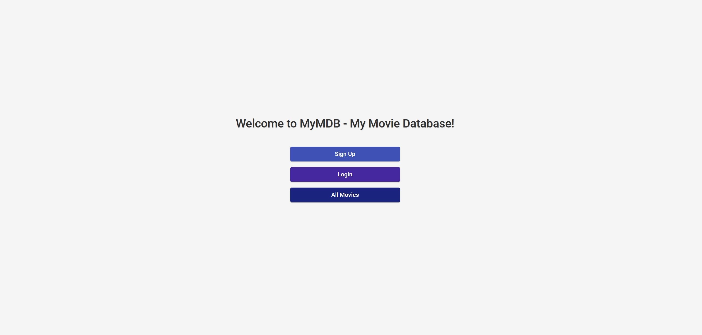
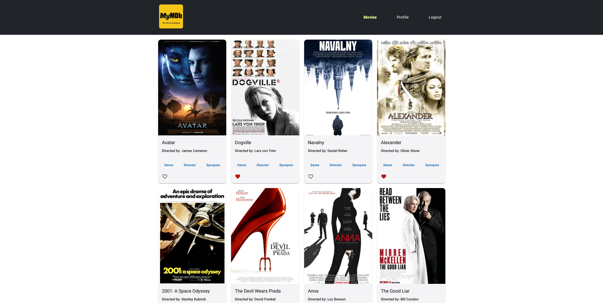

# 🎬 MyMDB - My Movie Database Client

## 📋 Project Overview
MyMDB is a client-side application built with Angular that interfaces with a movie API. It allows users to browse, search, and manage their favorite movies from Ian's collection, while maintaining their own watchlist and profile information.





## 🌟 Features
- User registration and authentication
- Movie browsing with detailed information
- Profile management
- Favorite movies functionality
- Responsive design for mobile and desktop
- Material Design interface

## 💻 Technologies Used
- **Frontend Framework:** Angular 17
- **UI Components:** Angular Material
- **Styling:** SCSS
- **State Management:** RxJS
- **Authentication:** JWT (JSON Web Tokens)
- **HTTP Communication:** Angular HttpClient
- **Form Management:** Angular Reactive Forms
- **Development Tools:**
  - TypeScript
  - Angular CLI
  - npm

## 🛠️ Technical Requirements
- Node.js (version 18 or later)
- Angular CLI (version 17 or later)
- Modern web browser with JavaScript enabled

## 🔗 Links
- [Live Demo](https://mymdb-angular.netlify.app)
- [API Documentation](https://mymdb-api.herokuapp.com/documentation)
- [GitHub Repository](https://github.com/ibxibx/mymdb-angular-client)

## 🚀 Setup Instructions
1. **Clone Repository**
   ```bash
   git clone https://github.com/ibxibx/mymdb-angular-client.git
   cd mymdb-angular-client
   ```

2. **Install Dependencies**
   ```bash
   npm install
   ```

3. **Environment Setup**
   - Create `environment.ts` file in `src/environments/`
   - Add API URL configuration:
     ```typescript
     export const environment = {
       production: false,
       apiUrl: 'YOUR_API_URL'
     };
     ```

4. **Start Development Server**
   ```bash
   ng serve
   ```
   Navigate to `http://localhost:4200/`

## 💭 Project Reflection
### Role & Responsibilities
- Full-stack development with focus on frontend implementation
- Design and implementation of user interface components
- Integration with REST API
- Implementation of user authentication and authorization

### Key Decisions & Outcomes
- Chose Angular Material for UI components to ensure consistency
- Implemented responsive design for better mobile experience
- Used JWT for secure authentication

### Lessons Learned
- Enhanced understanding of Angular's component architecture
- Improved skills in state management with RxJS
- Gained experience in implementing secure authentication

### Future Improvements
- Add movie recommendation system
- Implement social features
- Enhance search functionality
- Add offline capabilities

## 📜 License
This project is licensed under the MIT License - see the [LICENSE.md](LICENSE.md) file for details.
